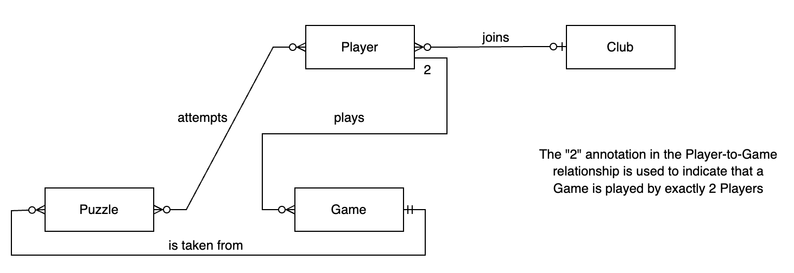

# Design Document

Video overview (~18 minutes): <https://www.youtube.com/watch?v=6KiQSnABFko>

## Scope

The purpose of this database is to (theoretically) organize and store information contained in an online chess website, some real-world examples being `chess.com` or `LiChess`.

My database will contain information on `players`, `clubs`, `games`, and `puzzles`.

The database will be based on an online chess website, not official in-person chess tournaments (`FIDE`). It will also not include some peripheral features of popular chess websites, such as lessons, bots, or forums.

## Functional Requirements

A user should be able to search for players that have a certain rank (`ELO`) or fit within a range of rank. They can even sort by ELO to see the top players in the world. The same can be done based on the `age` of the player's account. In addition, they can see all the games that a certain user has played, and all the players within a specific `club`. For puzzles, a user can see the `rating` of the puzzle (which indicates its difficulty) as well as how many people have solved it or attempted to solve it.

Users can only see games that have already been completed, not ones that are currently ongoing or scheduled to happen in the future.
I go into further detail in the ``Limitations`` section at the bottom.

## Representation

### Entities

The entities represented in my table are players, clubs, games, and puzzles.

`players` table:
- id, an `INTEGER` with a `PRIMARY KEY` constraint. This will uniquely identify a specific player/account.
- username, which will uniquely identify an account as `TEXT`, and will be visible in the games that the account plays as well as the clubs they join.
- password, which specifies the password of the account as `TEXT`
- reg_datetime, the `datetime` when account was created, with accuracy to the second.
- ELO, which is an `INTEGER` indicates how well a player performs.
- The default for an account is `1000`, with a minimum of `100` and no upper limit.
  - This will increase when the player wins games, and decrease when they lose.
- total_wins, an `INTEGER` that specifies how many wins the account has
- total_losses, an `INTEGER` that specifies how many wins the account has
- club_id, an `INTEGER` that specifies the id of the club that the player belongs to.
    - This will be NULL if the player does not belong to a club, which is by default.
    - If a club is deleted, the club_id will be set back to NULL.

Every attribute except club_id must be `NOT NULL`. Note that total_wins and total_losses can be `0`, which is the default for a new account.

`games` table:
- id, an `INTEGER` with a `PRIMARY KEY` constraint. This will uniquely identify a specific game.
- p1_id, an `INTEGER` with a `FOREIGN KEY` constraint that references players.id. This will uniquely identify the player with the white pieces.
- p2_id, an `INTEGER` with a `FOREIGN KEY` constraint that references players.id. This will uniquely identify the player with the black pieces.
  - Note that if a player account is deleted, all games tied to it will be deleted as well.
- time_control, an `INTEGER` that indicates the starting timer for each player, in minutes.
- game_result, `TEXT` that is constrained to one of three possibilities: `p1 win`, `p2 win`, or `draw`.

Every attribute must be `NOT NULL`.

`clubs` table:
- id, an `INTEGER` with a `PRIMARY KEY` constraint. This will uniquely identify a specific club.
- name, the name of the club as `TEXT`. This should also be unique to prevent confusion
- num_members, an `INTEGER` that specifies how many members the club currently has.
  - We must have a CONSTRAINT that prevents this from being higher than max_members
- max_members, an `INTEGER` that serves as the upper limit on how many players the club can have.
- club_category, which indicates what category the club is as `TEXT`.
  - This is constrained to casual, tournaments, school, or community of a renowned player.

Every attribute must be `NOT NULL`.

`puzzles` table:
- id, an `INTEGER` with a `PRIMARY KEY` constraint. This will uniquely identify a puzzle.
- release_date, the `date` formatted as  `YYYY-MM-DD` which is the date the puzzle was released on the site
- rating, an `INTEGER` that indicates how difficult the puzzle is to solve.
- game_id, an `INTEGER` that is also has a `FOREIGN KEY` that references games.id. This uniquely identifies the game that the puzzle is derived from.
  - This will be set to NULL if the game_id referenced is deleted.
  - Note that we are setting NULL and not doing CASCADE since the puzzle is still a valid resource even if the game itself does not exist.
- num_attempts is an `INTEGER` for the number of distinct players that have attempted to solve the puzzle
- num_solved, an `INTEGER` for the number of distinct players that successfully solved by finding the winning sequence of move(s)

Every attribute must be `NOT NULL`. Note that num_attempts and num_solved can be `0`, and are by default.

The constraints I chose for the `PRIMARY` and `FOREIGN` keys are necessary to uniquely identify specific players, games, clubs, or puzzles. Other constraints, such as `ELO` being at minimum `100`, align with actual chess websites I have used, and also prevent an account from having negative `ELO` at any point. I also used constraints due to the lack of `ENUM` in `SQLite`, when faced with creating categories for clubs. I used the `NOT NULL` constraint on almost every attribute since there is no situation for any of the entities to lack some of the information contained in their attributes. A few `ON DELETE` constraints were added to `FOREIGN KEY`s to prevent inconsistency between tables, such as a game existing where one or both of the players do not exist anymore.

### Relationships
The following is the Entity Relationship (ER) diagram depicting the relationship between the entities that make up the chess database

Players can play zero or many games, while a game must be played by exactly `2` players. A player may join at most one club, and a club can contain zero or many players at any given time. A player can attempt zero or many puzzles, and a puzzle is attempted by zero or many players. Lastly, a puzzle is taken from a single game, while a single game can provide zero or many puzzles.

## Optimizations

In this section you should answer the following questions:

Optimizations (views and indexes):
- I created a view that JOINed the `players` and `clubs` table, so that it is easier to query what members belong to a specific club. An example of such a query can be found in `queries.sql`. I also made a view that finds the puzzles from the past month, which chess websites commonly do with a calendar, where each day has its own puzzle assigned to it. A third view lists player ids and the games they have played.
- I create three indexes based on attributes I expected to be searched often. One was for player `usernames`, since account lookup is quite common. Another was for `club category`, since I can imagine a player wanting to filter clubs that they want to join based upon this category. Lastly, puzzles are often searched for by `release date`, with a similar logic to the second view, and so I created an index based on it.

## Limitations

One limitation is the security of the passwords -- it would be best to hash the password rather than have it stored directly in the database, using a protocol like MD5. Maintaining concurrency is also important, since we need to update `ELO` of two players at once each time a game finishes.

This database also does not tie a player's account to the specific puzzles they have attempted or solved. Even if a user knows a puzzle `id`, they cannot check if they have already attempted or solved it using the database. I also cannot represent a player that can join more than 1 `club`, since there is only 1 `club_id` slot in the `players` table. In addition, there are many "special" modes on chess websites, such as 2 vs 2, Bughouse, King of the Hill, and more, which are not captured by this database since `games` are only differentiated by `2` players and the `time control`. I also lack a way to represents `tournaments` currently, which is a very common and well-used feature on chess platforms.

### Final Thoughts

Note that this is not (yet!) a database used in the real world, but rather an exercise for how I would design such a relational database. Thanks for checking it out!
